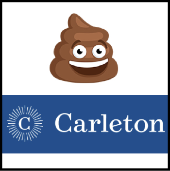

# CRAP@Carleton

Course Registration and Planning (CRAP) is a tool to help students plan their courses for next term.



CRAP@Carleton is the version for Carleton students, but feel free to fork and bring to other schools!

## Usage

For dev install, make sure node/npm is installed.

```bash
npm install
npm start
```

## Contributing

Please feel free to contribute! The whole point of this project is to give students have control over their course registration software, and empower them to create features they want to see. [Here is an introduction to creating a fork and pull request](https://help.github.com/articles/creating-a-pull-request-from-a-fork/).

## Alternative Name

As this software is intended to replace [ENROLL](https://apps.carleton.edu/campus/registrar/schedule/enroll/), and alternative project name might be EIM (Enroll IMproved). :smile:


